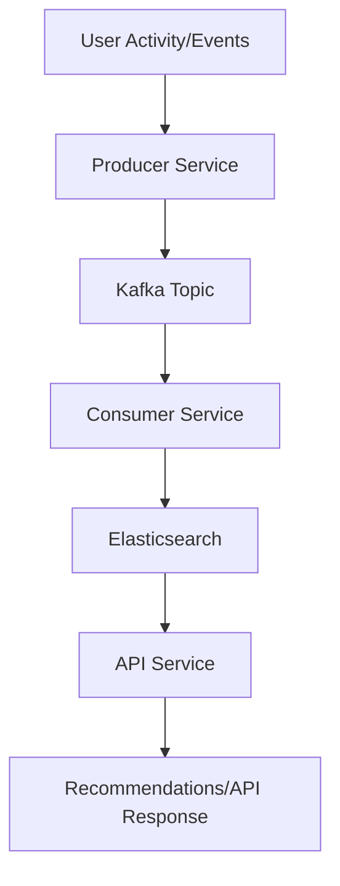

# Kafka-Elastic-Search-Recommendation-Engine

A scalable, real-time recommendation engine built with Kafka, Elasticsearch, and a microservices-oriented architecture. The system is optimized for ingesting, processing, and searching large-scale event data, enabling personalized recommendations with high throughput and low latency.

---

## Table of Contents

1. [Project Overview](#project-overview)
2. [Architecture](#architecture)
3. [Data Flow Diagram](#data-flow-diagram)
4. [Project Structure](#project-structure)
5. [API Services and Endpoints](#api-services-and-endpoints)
6. [Local Setup Instructions (Using Docker)](#local-setup-instructions-using-docker)
7. [Important Concepts Used](#important-concepts-used)
8. [Contributing](#contributing)
9. [License](#license)

---

## Project Overview

This project demonstrates how to build a robust recommendation engine using:
- **Apache Kafka** for streaming and buffering events,
- **Elasticsearch** for fast, scalable search and analytics,
- **Java**, **Python** & **Scala** for microservices and data processing.

It supports ingesting real-time user activities, processes them, and generates personalized recommendations using streaming and batch analytics.

---

## Architecture

**Components:**
- **Producer Service (Java/Python):** Sends user/item event data to Kafka topics.
- **Kafka Cluster:** Acts as a distributed message broker, decoupling producers and consumers.
- **Consumer Service (Scala/Java):** Consumes events, processes them, and saves relevant data into Elasticsearch.
- **Elasticsearch:** Stores and indexes processed data for querying and recommendations.
- **API Service (Python/Java):** Exposes endpoints for fetching recommendations.

**High-Level Architecture:**

```
+---------------+       +---------+      +-------------+      +------------------+
|  Producers    |-----> |  Kafka  |----> | Consumers   |----> | Elasticsearch DB |
+---------------+       +---------+      +-------------+      +------------------+
                                                        |
                <----------------------API Service------------------------>
```

---

## Data Flow Diagram



---

## Project Structure

```text
Kafka-Elastic-Search-Recommendation-Engine/
├── docker/
│   ├── kafka/
│   ├── elasticsearch/
│   └── ...
├── producer/
│   └── (Java/Python clients that send data to Kafka)
├── consumer/
│   └── (Scala/Java Kafka consumers)
├── api/
│   └── (Java/Python API endpoints for recommendations)
├── search-service/
│   └── (Java Spring Boot search/recommendation endpoints)
├── utils/
│   └── (Shared utility scripts, configs)
├── data/
│   └── (Sample/mock data for testing)
└── README.md
```

- **docker/**: Docker Compose setup for all core services.
- **producer/**: Data/event producer implementations.
- **consumer/**: Data pipeline logic, receives events and transforms them for Elasticsearch.
- **api/**: REST API services to serve recommendations.
- **search-service/**: Java-based API for product search and recommendations.
- **utils/**: Helper scripts and configuration files.
- **data/**: Example datasets.

---

## API Services and Endpoints

### 1. Product Search Endpoint

- **Method:** `GET`
- **Path:** `/search/product`
- **Description:** Searches for products by query, with optional price and category filtering.

**Parameters:**
- `query` (required): Search term.
- `price` (optional): Filter by price.
- `category` (optional): Filter by category.

**Example:**
```sh
curl "http://localhost:8080/search/product?query=laptop&price=1500&category=electronics"
```

---

### 2. Product Recommendation Endpoint

- **Method:** `GET`
- **Path:** `/recommend/product`
- **Description:** Returns content-based product recommendations given a `productId`.

**Parameters:**
- `productId` (required): The product ID for which recommendations are fetched.

**Example:**
```sh
curl "http://localhost:8080/recommend/product?productId=12345"
```

**Note:**  
- These endpoints are served by the `search-service` (Java Spring Boot).
- Default API port: `8080` (adjust if different in your Docker setup).

---

## Local Setup Instructions (Using Docker)

### Prerequisites

- [Docker](https://www.docker.com/) & [Docker Compose](https://docs.docker.com/compose/)

### Steps

1. **Clone the repository:**
    ```sh
    git clone https://github.com/Rakeshwar/Kafka-Elastic-Search-Recommendation-Engine.git
    cd Kafka-Elastic-Search-Recommendation-Engine
    ```

2. **Update environment/configuration files if necessary**  
   (Check under `docker/`, `producer/`, `consumer/`, etc.)

3. **Start all services using Docker Compose:**
    ```sh
    docker-compose up --build
    ```
    This sets up:
    - Kafka cluster (and Zookeeper)
    - Elasticsearch server
    - Producer/Consumer containers
    - API Service

4. **Verify Services:**
    - Kafka: `localhost:9092`
    - Elasticsearch UI: `localhost:9200`
    - API: By default, `localhost:8080` or as configured

5. **Generate sample data (optional):**
    ```sh
    python producer/generate_sample_data.py
    ```
    This sends demo data to the Kafka topic.

6. **Fetch Recommendations:**
    ```sh
    curl http://localhost:8080/recommend/product?productId=<your_product_id>
    ```

---

## Important Concepts Used

- **Apache Kafka (Streaming):** For high-throughput, fault-tolerant event ingestion.
- **Elasticsearch (Search & Analytics):** Indexing events for quick retrieval, aggregation, and complex queries.
- **Microservices:** Decoupled services for ingestion, processing, and API.
- **Polyglot Implementation:** Java, Python, & Scala are used as best suited for each component.
- **Dockerization:** Complete environment setup using Docker Compose for easy reproducibility.
- **Scalability:** Easily scale any service/component by modifying the `docker-compose.yml`.

---

## Extending the System

- Add real recommendation algorithms (collaborative filtering, content-based, etc.) in the consumer/API layer.
- Integrate monitoring (e.g., Kibana, Prometheus).
- Deploy to cloud services (AWS, GCP, Azure, etc.)
- Implement authentication & authorization in the API layer.
- Add CI/CD with GitHub Actions.

---

## Contributing

PRs and improvements are welcome!  
See [CONTRIBUTING.md](CONTRIBUTING.md) (if present) or open an issue to get started.

---

## License

Distributed under the MIT License. See `LICENSE` for more information.

---

## Contact

For support, open a GitHub [issue](https://github.com/Rakeshwar/Kafka-Elastic-Search-Recommendation-)
